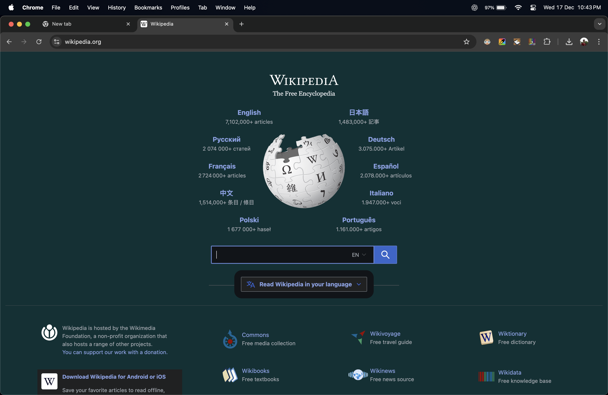
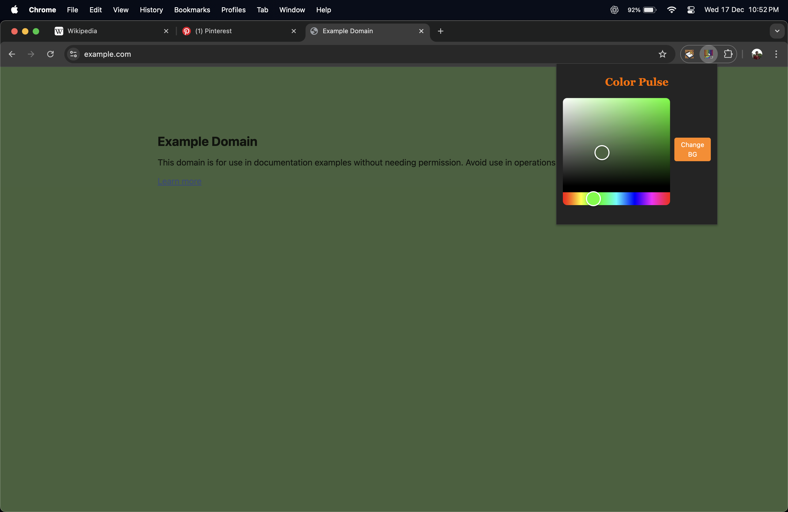
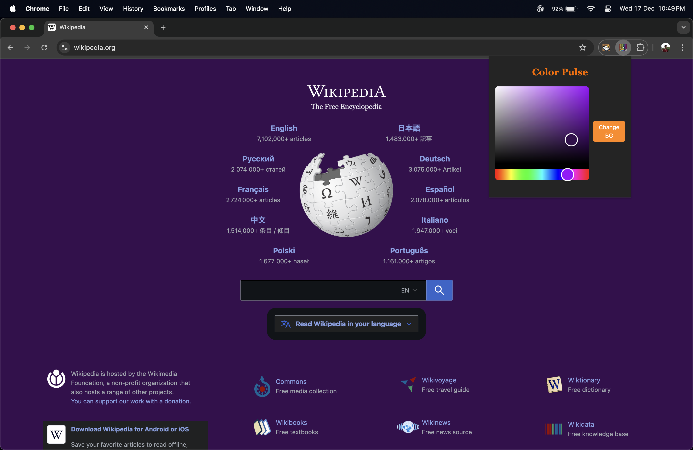

# Color Pulse

Color Pulse is a lightweight Chrome extension that allows users to change the background color of any webpage instantly. It is designed to improve readability visual comfort and focus through a simple and clean interface.

## Overview

Color Pulse provides a minimal popup with a color picker. When a user selects a color and clicks the action button the extension applies the chosen background color to the currently active webpage without reloading the page.

The extension is built using modern web technologies and follows Chrome Web Store best practices including single purpose functionality minimal permissions and no data collection.

## Features

Change webpage background color instantly  
Clean and minimal popup interface  
Works on all standard websites  
No page reload required  
No user data collection

## Tech Stack

TypeScript  
React  
Vite  
Tailwind CSS  
Chrome Extensions Manifest V3

## How It Works

The extension uses the activeTab permission to temporarily access the currently active tab only after a user interaction. A small script is injected into the page to update the background color of the document body based on the selected color.

All logic is bundled locally and no remote code is executed.

## Installation for Development

Clone the repository

git clone https://github.com/Shashwat-06/Color-Pulse-Chrome-Extension.git

Install dependencies

npm install

Build the extension

npm run build

Load the extension in Chrome

Open chrome://extensions  
Enable Developer Mode  
Click Load unpacked  
Select the dist folder

## Screenshots

## Usage

Open any website  
Click the Color Pulse extension icon  
Select a background color  
Click the change button to apply the color

## Permissions Used

activeTab is used to apply background color changes only to the currently active tab after a user action  
scripting is used to inject a small script that updates the webpage background

## Privacy

Color Pulse does not collect store or transmit any user data. All operations are performed locally within the browser.

## License

This project is open source and available under the MIT License.
